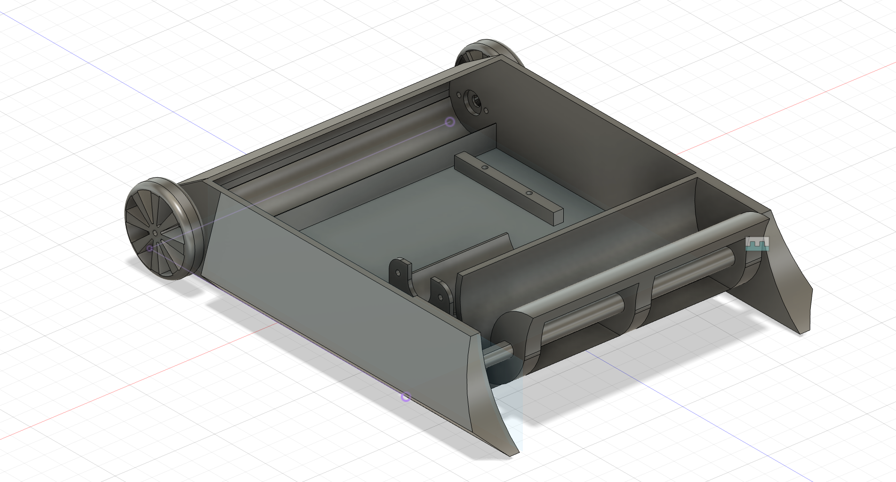
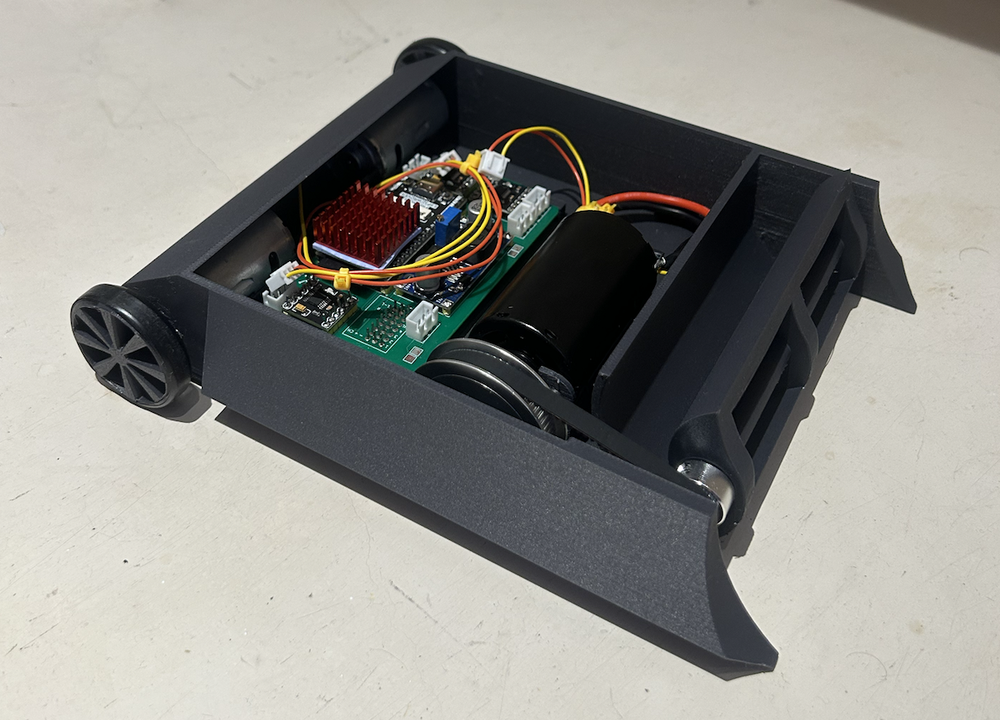
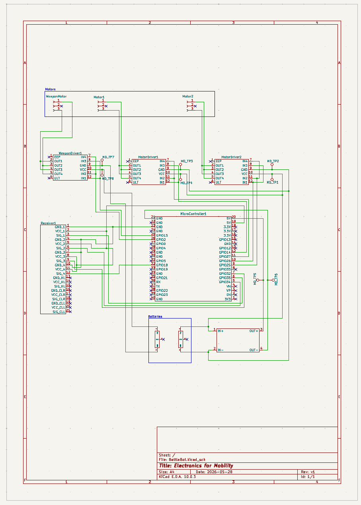
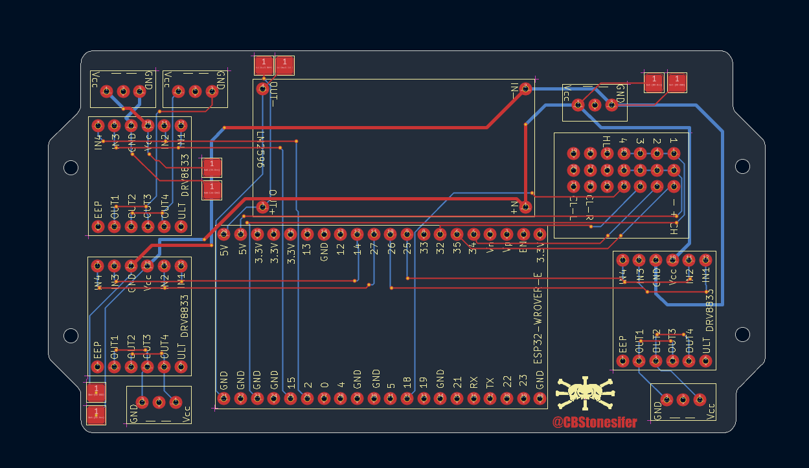
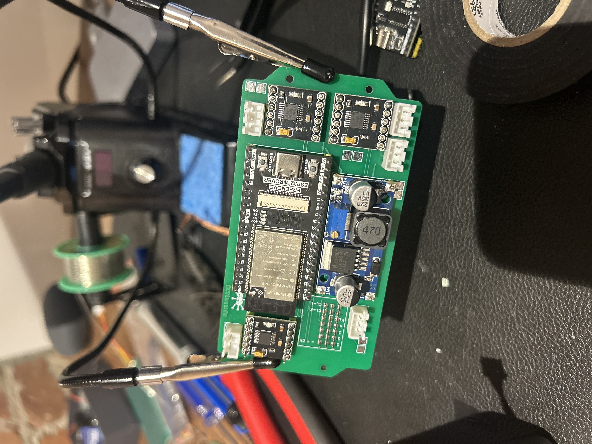

# Project Galleila — Beater-Bar BattleBot

A 3-pound (beetleweight) combat robot designed and built across the full hardware stack: mechanical CAD, PCB layout, and embedded firmware. The goal was a **reproducible end-to-end build process** — from CAD model to fabricated board to driving firmware — rather than peak performance. V2 will optimize for weight and combat performance.

**Skills demonstrated:** Fusion 360 / FDM prototyping · KiCad schematic + layout · custom footprint creation · Gerber fabrication output · ESP32 embedded C · RC PWM decode · LEDC motor PWM · skid-steer mixing

---

## Repo Structure

```
cad/          — 3D-printable chassis, wheels, and weapon (STL + 3MF)
pcb/          — KiCad schematic, layout, custom footprints, and gerbers
firmware/     — Arduino sketch for ESP32 (RC decode + motor mixing)
```

---

## Bill of Materials

| # | Component | Part | Qty | Specs | Link |
|---|-----------|------|-----|-------|------|
| 1 | MCU | ESP32 dev board | 1 | Dual-core 32-bit, 240 MHz, 3.3V, WiFi + BT | [Amazon](https://www.amazon.com/dp/B0C9TGJRPH) |
| 2 | Motor driver | DRV8833 | 3 | 1.5 A continuous, 2 A peak | [Amazon](https://www.amazon.com/dp/B0DXF6LZB1) |
| 3 | Buck regulator | LM2596 | 1 | 3–40V in, 1.5–35V adj out | [Amazon](https://www.amazon.com/dp/B0DBVYP91F) |
| 4 | Battery | 2S LiPo | 1 | 7.4V, 2000mAh, T-plug | [Amazon](https://www.amazon.com/dp/B0FCFVWS1K) |
| 5 | RC transmitter + receiver | — | 1 set | PWM out, 2-channel minimum | [Amazon](https://www.amazon.com/dp/B0FJDFJ38M) |
| 6 | Drive motors | 390 brushed | 2 | 6–12V, high-torque | [Amazon](https://www.amazon.com/dp/B01M58POHF) |
| 7 | Weapon motor | Brushed | 1 | TBD | [Amazon](https://www.amazon.com/dp/B0FXG6J3Z9) |
| 8 | Weapon belt drive | GT2 pulley + belt | 1 set | 20T / 60T, 8mm bore, 200mm belt | [Amazon](https://www.amazon.com/dp/B08QZ4365D) |
| 9 | Connectors | JST-XH 3-pin | 10 pairs | 2.54mm pitch, 26AWG, 200mm | [Amazon](https://www.amazon.com/dp/B0D3LVLMP9) |
| 10 | Print filament | PLA-CF 1.75mm | 1 spool | 1kg, carbon-fiber reinforced | [Amazon](https://www.amazon.com/dp/B0D7VV1YC7) |

---

## CAD

**Tool:** Fusion 360 → FDM (PLA-CF)  
**All parts:** `cad/` — available as both `.stl` and `.3mf`

| File | Description |
|------|-------------|
| `chassis.stl` / `.3mf` | Unitary chassis: electronics bay, drive motor mounts, weapon mount |
| `drive_wheel.stl` / `.3mf` | Drive wheels (print ×2) |
| `weapon_impactor.stl` / `.3mf` | Beater-bar weapon impactor |

Drive and weapon subsystems were first validated as separate prints, then consolidated into a single `chassis` once geometry was confirmed. Total bot target: ≤ 3 lb; drive motors are the dominant mass — body is designed to be as light as possible.

| | |
|---|---|
|  |  |
| *Fusion 360 render — `chassis`* | *Mark 1 assembled — PCB and drive motor installed* |

---

## ECAD

**Tool:** KiCad 7  
**Fabrication output:** `pcb/gerbers/battlebot_gerbers_v1.zip` — ready to send to any fab house

### Files

| File | Purpose |
|------|---------|
| `pcb/BattleBot.kicad_sch` | Full schematic |
| `pcb/BattleBot.kicad_pcb` | Board layout |
| `pcb/BattleBot-parts.kicad_sym` | Custom KiCad symbol library |
| `pcb/BattleBot.pretty/` | Custom footprint library (6 footprints) |
| `pcb/gerbers/` | Gerber + drill files |

### Power Architecture

```
LiPo ──→ LM2596 (buck) ──→ 5V ──→ ESP32-WROVER-E
LiPo ──→ DRV8833 (×3) ──→ Drive motors + weapon motor (direct VBAT)
```

### GPIO Pin Assignments

| Signal | ESP32 GPIO |
|--------|-----------|
| RC Steering (PWM in) | 35 |
| RC Throttle (PWM in) | 34 |
| RC Weapon toggle (PWM in) | 18 |
| Left motor IN1 | 25 |
| Left motor IN2 | 26 |
| Right motor IN1 | 27 |
| Right motor IN2 | 14 |
| Weapon motor IN1 | 2 |
| Weapon motor IN2 | 15 |
| nFAULT (DRV8833) | 33 |
| UART0 debug | 115200 baud |

### Custom Footprints

All footprints in `pcb/BattleBot.pretty/` were drawn from datasheets:

| Footprint | File |
|-----------|------|
| ESP32-WROVER-E | `ESP32-WROVER-E.kicad_mod` |
| DRV8833 | `DRV8833.kicad_mod` |
| LM2596 | `LM2596.kicad_mod` |
| RC Receiver | `Reciever.kicad_mod` |
| 3-pin connector | `3Pin-Connector.kicad_mod` |
| Test point pad | `Testpoint-Pad.kicad_mod` |


*Schematic — `BattleBot.kicad_sch`*

| | |
|---|---|
|  |  |
| *Layout — `BattleBot.kicad_pcb`* | *KiCad 3D render* |


*Fabricated and populated board*

---

## Firmware

**Toolchain:** Arduino IDE + ESP32 board support package  
**Board target:** ESP32 Wrover Module  
**Sketch:** `firmware/signal_driver/signal_driver.ino`

### Control Loop

```
loop()
  ├── readSteering()   — pulseIn GPIO 35 → map to [-100, 100] → deadband
  ├── readThrottle()   — pulseIn GPIO 34 → map to [-100, 100] → deadband
  ├── pulseIn GPIO 18  — weapon toggle (> 1500 µs = ON)
  ├── mixAndDrive()    — skid-steer mix → setMotor() → LEDC PWM duty
  ├── setWeapon()      — full speed on WEAPON_IN1/IN2 when armed
  └── fault poll       — read GPIO 33 nFAULT → Serial.print @ 115200
```

### Motor Mixing (skid-steer)

- **Straight:** `left = right = throttle`
- **Driving turn:** inner wheel = `throttle × (TURN_MIX_RATIO / 100)`
- **Spin-in-place:** `left = +steering`, `right = −steering`

### Calibration Constants

| Constant | V1 Value | Purpose |
|----------|----------|---------|
| `STEERING_MIN` | 965 µs | Min receiver pulse |
| `STEERING_MAX` | 1882 µs | Max receiver pulse |
| `THROTTLE_MIN` | 1055 µs | Min throttle pulse |
| `THROTTLE_IDLE` | 1565 µs | Neutral position |
| `THROTTLE_MAX` | 2000 µs | Max throttle pulse |
| `DEADBAND` | 5 | Noise rejection around neutral |
| `TURN_MIX_RATIO` | 50 | Inner-wheel scaling (0–100) |
| `PWM_FREQ` | 20,000 Hz | LEDC motor PWM frequency |
| `PWM_RES` | 8-bit | Duty cycle range (0–255) |

> These constants are radio-specific. Re-measure pulse widths for your transmitter before first drive.

### Flash Instructions

1. Install ESP32 board support in Arduino IDE
2. Open `firmware/signal_driver/signal_driver.ino`
3. Select **ESP32 Wrover Module**, set the correct COM port
4. Update calibration constants for your RC radio
5. Upload

---

## Known Issues

These are the honest limitations of V1:

- **Motor sizing unverified** — DRV8833 is rated for 1.5 A continuous / 2 A peak per channel. Motor stall currents have not been measured; choosing motors with high stall current will thermally load or latch the drivers.
- **Fault handling is passive** — `nFAULT` on GPIO 33 is polled and printed to Serial but does not cut motor output. A driver fault during a match will not stop the bot.
- **`pulseIn()` blocks the loop** — RC decode uses blocking `pulseIn()` calls. At 20 ms RC frame rate this is fine, but it prevents any concurrent processing (e.g., fault response).
- **PLA is prototype-grade** — adequate for bench testing, fragile in hard combat impacts. Weapon impactor especially is subject to shatter.

---

## Further Improvements (V2)

These are the obvious next steps — already planned:

- **Right-size the drivers** — measure motor stall current, swap DRV8833 for a driver with appropriate continuous rating (e.g., DRV8874, TB6612FNG, or discrete FETs for higher current).
- **Active fault response** — nFAULT interrupt → immediate motor cutoff, not just a Serial print.
- **Non-blocking RC decode** — replace `pulseIn()` with interrupt-driven pulse capture to free the loop for concurrent tasks.
- **Weapon arm/disarm logic** — currently a raw threshold toggle; a proper arm sequence (e.g., hold for 1 s) would prevent accidental spin-up.
- **Hardened weapon impactor** — machine or print in PETG/nylon/polycarbonate; evaluate a metal impactor for the beater bar.
- **Weight optimization** — V1 BOM was chosen for availability, not mass. Profile actual component weights and re-spec motors, battery, and hardware for the 3 lb envelope.
- **Documented print settings** — record layer height, infill %, wall count, and orientation for each part so prints are reproducible without guesswork.

---

## Status

| Version | Status | Focus |
|---------|--------|-------|
| V1 | Complete | Cost-optimized, full-stack process established |
| V2 | Planned | Weight/performance, hardened materials, active fault handling |
